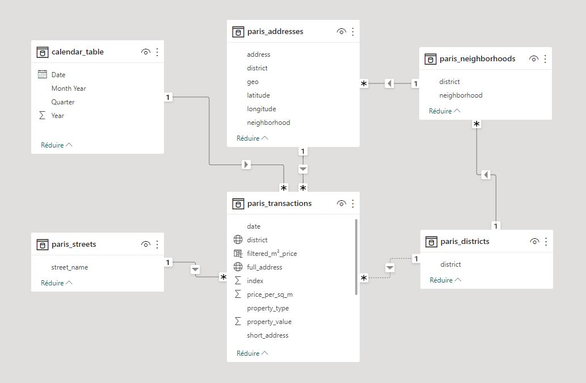

# PARIS REAL ESTATE MARKET: 2014-2020

# I. Code and visualizations links

Check my [Power BI dashboards](https://app.powerbi.com/view?r=eyJrIjoiZDc5ZWI1NzItOTM2ZC00MzdkLThhMWUtNjk0NjIwYzg2NjRkIiwidCI6ImJiZGQ3YzVjLTMwYjQtNGEwMi1iNDI1LWUzODNiOGJkNWRhMSJ9)!

I used an original dataset from [Opendatasoft](https://data.opendatasoft.com/explore/dataset/demande-de-valeurs-foncieres-agrege-a-la-transaction%40public/table/?flg=fr&refine.nom_reg=ILE-DE-FRANCE&refine.nom_dep=PARIS&refine.nature_mutation=Vente&refine.commune=PARIS+12&refine.date_mutation=2019&sort=-no_voie&q=&location=16,48.83295,2.40516&basemap=jawg.streets)

All the resulting datasets following data transformations on Power Query can be found on this project's directories.

The relationships between tables are set following the below chart:



# II. Geocoding

The real challenge in this project was to map addresses to geographical areas and represent them on a map chart.
Indeed, though Power BI is packed with geographical options when dealing with country-level data, it becomes lacking when dealing with small areas like districts and neighborhoods (especially when not dealing with data unrelated to the US).

Power BI therefore allows users to build custom shape maps according to their needs using JSON, GeoJSON and TopoJSON files.
GeoJSON and TopoJSON files are commonly used in Geographical Information Systems (think ArcGIS, Mapbox).

A common use case for GeoJSON points is geocoding: a geocoded address like "130 AV VICTOR HUGO, 75016 PARIS" can be seen as:

```
{
    "type": "Point",
    "address": "130 AV VICTOR HUGO",
    "district": "75016",
    "city": "PARIS",
    "coordinates": [2.280226, 48.86764]
}
```

Geographical positions here come in the format [lng, lat]. Indeed, longitude comes before latitude in GeoJSON and TopoJSON.

Geographical areas can be seen as polygons, which are shapes defined by a connected series of unique x,y coordinate pairs called arcs.
GeoJSON polygons represent closed shapes on a map, like triangles, squares, dodecagons, or any shape with a fixed number of sides. For instance, the below GeoJSON polygon roughly represents the city limits of Paris:

```
{
  "type": "Polygon",
  "coordinates": [[
    [
      2.3917,
      48.9002
    ],
    [
      2.3994,
      48.8825
    ],
    [
      2.4079,
      48.8794
    ],
    [
      2.4114,
      48.8346
    ],
    [
      2.352,
      48.8163
    ],
    [
      2.2738,
      48.8353
    ],
    [
      2.2576,
      48.8351
    ],
    [
      2.2511,
      48.8516
    ],
    [
      2.3189,
      48.8995
    ],
    [
      2.3917,
      48.9002
    ]
  ]]
}
```

All the geographical features used for the custom shape maps in my Power BI visualization are stored in `data/geographical_features`.